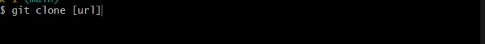
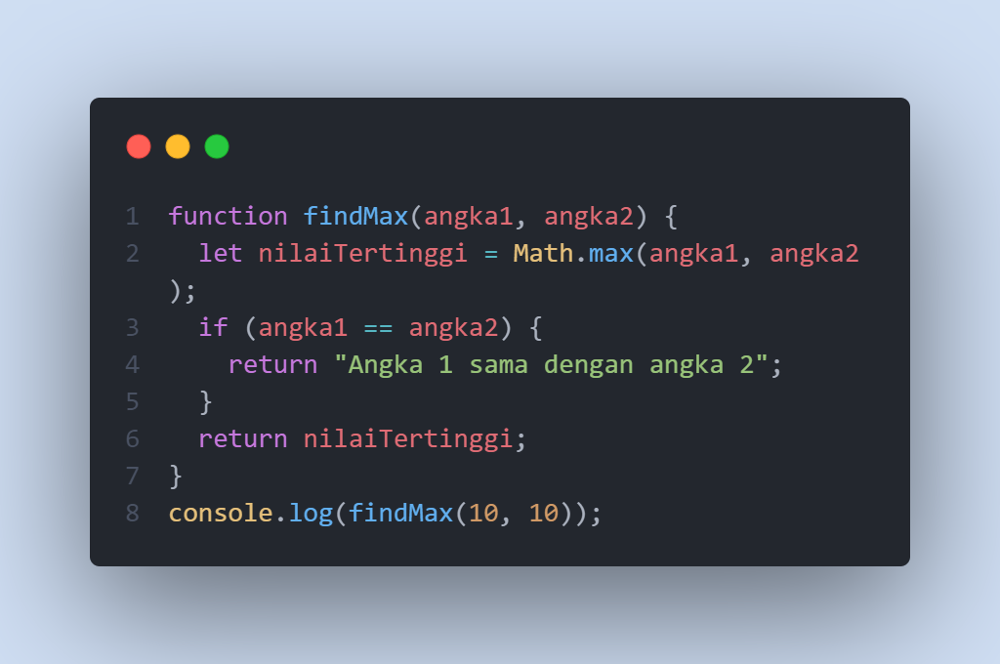

# Rangkuman Week 1

###### Nama  : Muhammad Arya Wirawan
###### Group : FE 2 - Kelompok 8
###### Mentor : Thoriq Nur Faizal

## Unix Command Line

-  ### Shell   
    Shell merupakan suatu program yang menerima perintah kita yang kemudian akan diteruskan kepada sistem untuk dieksekusi
- ### CLI (Command Line Interface)  
    CLI merupakan Shell yang berbasis teks
- ### Terminal   
    User membutuhkan suatu tempat/aplikasi untuk memberikan perintah kepada sistem. Tempat tersebut dapat kita sebut dengan Terminal. Kita dapat menggunakan shell di terminal.
- ### File System Structure 
    
  Dalam sistem, filesystem mengatur bagaimana data/file kita disimpan dalam sistem tersebut. biasanya disusun menggunakan struktur yang bentuknya mirip tree/pohon
- ### Command 
    - pwd (print working directory)  
        command untuk melihat current working directory
    ``` 
    Caranya: ketik pwd pada CLI kita maka akan menampilkan posisi terkini dari direktori yang aktif saat itu
    ```

    - ls (list)  
        command untuk melihat isi file yang ada di direktori 
    ```
   Caranya: ketik ls pada CLI, makan akan menampilkan list file yang ada pada direktori
    ```
    - cd (change directory)  
        command untuk pindah ke direktori lain  
    ```
    Caranya: ketik cd {namaDirektori} atau masukkan path direktori yang akan kita tuju.
    ```
    - cat  
        command untuk melihat isi file
    ```
    Caranya: ketikan cat {namaFile}. maka akan menampilkan file yang kita tuju tadi.
    ```
    - head  
    ```
    command untuk melihat beberapa line awal dari sebuah text file
    Caranya: ketik head {namaFile}, maka akan menampilkan beberapa baris awal dari file tersebut.       
    Kita juga dapat menambahkan -n {jumlah line yang akan dilihat} untuk melihat jumlah line secara spesifik
    ```
    - tail  
        command untuk melihat beberapa line akhir dari sebuah text file
    ```
    Caranya sama seperti command pada head, kita dapat melihat beberapa line akhir dari sebuah file
    ```
    - touch 
        command untuk membuat sebuah file
    ```
    Ketik touch {namaFile} untuk membuat file
    ```
    - mkdir
        command untuk membuat sebuah direktori
    ```
    Ketik mkdir {namaDirektori} untuk membuat direktori atau folder
    ```
    - cp
        command untuk menyalin file atau direktori
    - mv 
        command untuk memindahkan file atau direktori. command ini juga bisa digunakan untuk merename
    - rm 
        command untuk menghapus file atau direktori  
<!-- Github -->
## Git & Github
- ### Apa itu Git & Github
    Git adalah aplikasi yang dapat melacak perubahan yang terjadi pada file/folder. Biasanya digunakan oleh programmer untuk menyimpan file karena lebih efektif 
    Github adalah platform web based penyedia layanan git yang digunakan programmer untuk menyimpan atau hosting repository mereka 
- ### Why should use Git & Github
    Dengan menggunakan Git & Github, kita dapat berkolaborasi mengerjakan project yang sama tanpa harus copy paste folder aplikasi yang terupdate. Kita juga dapat membuat file dalam project yang sama dengan partner kita tanpa harus menunggu mereka menyelesaikan program.
- ### Alur Kerja Git & Github
    Create file -  git init - git add - git commit - git push
- ### Command pada Git 
    - git init <nama-project>. digunakan untuk membuat repository. 1 repo = 1 project = 1 direktori
    
    - git status. Digunakan untuk mengetahui status dari repository lokal
    - git add. Digunakan untuk menambahkan file baru pada repository 
    
    - git commit. Digunakan untuk menyimpan perubahan yang telah dilakukan pada lokal repository.
    
    - git push origin. digunakan untuk mengpublish file ke remote repository Github.
    Caranya, pertama kita buat repository terlebih dahulu di Github
      
    setelah itu, kita push file yang ada di local repo kita dengan cara:
    
    And, kita telah berhasil publish local repository kita ke Github
    
    - git clone. digunakan untuk 'mendownload' atau melakukan cloning dari Github ke lokal/komputer
    
<!-- HTML -->
## HTML
- ### Peran HTML
    HTML adalah singkatan dari Hyper Text Markup Language. Peran dari HTML yaitu untuk menampilkan konten pada web/browser. Konten yand ditampilkan dapat **berupa** teks, gambar, video, link, dan lain-lain. 
- ### Tools HTML
    Tools utama yang harus dipersiapkan untuk membuat HTML adalah Browser dan juga Code Editor. Browser kita dapat menggunakan Google Chrome, Mozilla Firefox dll. Sedangkan untuk Code Editor kita dapat menggunakan VS Code, Sublime text ataupun yang lain
- ### HTML Sederhana
    - Element HTML
    
    - Element HTML dengan Atribut
    
    Struktur HTML paling sederhana membuat element html, head, dan body   
    Contoh kerangka HTML sederhana:
    
- ### Live Server
  Untuk dapat melihat file HTML kita di browser, kita dapat mengcopy path HTML kita.   
  atau kita dapat menggunakan Extension VS Code yaitu Live Server
  
  Dengan menggunakan live server, kita dapat melihat file HTML kita di browser secara live.   
  Output:
  
- ### Popular Tag HTML
    HTML memiliki tag-tag yang paling sering digunakan ketika kita mendevelop sebuah website. Popular Tag HTML antara lain:
    - img
     
    - video
    
    - table
    
    - form
    
- ### Semantic HTML
    Semantic HTML adalah penggunaan tag HTML yang sesuai dengan kebutuhan konten yang akan dibuat. Penggunaan Semantic HTML sangat membantu developer agar code kita lebih "Easy to read and understand". Kegunaan lain dari penggunaan Semantic HTML adalah meningkatkan aksesibilitas dan SEO Friendly.   
    Contoh Tag Semantic HTML: 
    
- ### Deployment
    Deploy adalah proses untuk menyebarkan aplikasi yang sudah kita buat agar bisa digunakan oleh orang-orang.   
    **Gimana caranya?**   
    Kita bisa gunakan tools yang namanya **Netlify** nihh. Nanti kita tinggal daftar aja terus kita connect-in netlify kita dengan Github untuk mendeploy repository kitaa. Mudah kan?
<!-- CSS -->
## CSS
- ### Peran CSS
    CSS adalah bahasa yang digunakan untuk mendesain halaman website kita. Dengan menggunakan CSS, kita dapat mengubah warna, font, layout, dan lainnya pada website kita
- ### Basic Syntax CSS
    Struktur CSS sebagai berikut:    
    
    Penjelasan
    - h1  
    h1 adalah selector berupa element HTML yang akan diubah
    - color   
    color merupakan property CSS berupa bagian mana yang akan diubah. 
    - red   
    red adalah value yaitu nilai dari property CSS   
- ### Cara Menyisipkan CSS ke HTML
    Ada tiga cara untuk menyisipkan CSS ke HTML
    - inline CSS
    
    - tag style
    
    - .css file
    
- ### Styling HTML
    Contoh melakukan styling pada element HTML:  
    
    Kita lakukan sytling pada CSS
    

- ### Responsive Web Design 
    Responsive Web Design adalah bagaimana caranya kita dalam mendesain dan styling website kita terlihat rapih di semua tipe device. Responsive Web Design akan secara otomatis menyesuaikan perbedaan lebar dan tinggi layar ketika membuka website kita. Kita dapat membuat Responsive Web Design dengan CSS Flexbox & Grid 
- ### Flexbox
    - Flexbox adalah salah satu cara untuk mengatur layout pada CSS. Flexbox memiliki kemampuan untuk menyesuaikan layout secara otomatis. Flexbox memiliki flexbox container dan juga flexbox items   
    
    styling CSS:
    
    Output:
    
    Keterangan:
      - div background biru merupakan container flex
      - div dengan warna kuning merupakan item dari container flex
    - Property Flexbox
      - justify-content, untuk mengatur tata letak secara horizontal
      - align-items, untuk mengatur align dari item secara vertikal
<!-- Algoritma -->
## Algoritma & Data Structures
- ### Perbedaan
    - Algoritma adalah deskripsi berupa step-step yang dibutuhkan untuk menyelesaikan suatu masalah
    - Data Struktur adalah cara menyimpan dan mengatur data secara terstruktur pada sistem komputer atau database sehingga lebih mudah diakses.
- ### Manfaat
    Dengan mempelajari algoritma dan data struktur,  membuat programmer lebih mudah dalam mengelola sebuah data dan juga membantu menyelesaikan permasalahan menggunakan data tersebut secara efisien
- ### Membuat Algoritma Sederhana
    Contoh algoritma sederhana untuk mengkalikan 2 angka yang diinput oleh user   
    Step 1 : Mulai
    Step 2 : Deklarasikan variabel angka1, angka2, dan perkalian
    Step 3 : Ambil nilai angka1 dan angka2
    Step 4 : Kalikan angka1 dan angka 2 dan masukkan hasilnya ke variable perkalian
    Step 5 : Tampilkan hasil perkalian
    Step 6 : Selesai   
- ### Menerapkan Algoritma ke bahasa pemograman
    Implementasi ke bahasa Javascript
    
- ### Algoritma dengan Javascript
    Contoh mengerjakan project di google slide. Mencari nilai max dari dua nilai yang diberikan.
    

<!-- JS -->
## Javascript
- ### Intro to Javascript
    - Apa itu javascript? 
        Javascript adalah bahasa pemograman yang sangat powerful yang digunakan untuk logic pada sebuah website. Javascript membuat website kita menjadi lebih interaktif
    - Bagaimana menjalankan Javascript? 
        Javascript dijalankan pada website device setiap user. Sebagai developer, kita dapat menambahkan tag script pada file HTML
    ```
    <script src="script.js"></script>
    ```
    - Operator Aritmatika pada Javascript
    ```
    + : Penjumlahan
    - : Pengurangan
    * : Perkalian
    % : Sisa pembagian (modulus)
    ++ : increment
    -- : decrement
    / : Pembagian
    ** : Pangkat

    ```
    - Operator Perbandingan dan logika pada Javascript
    ```
    == -> sama dengan (tidak dengan tipe data)
    === -> sama dengan (dengan tipe data)
    != -> tidak sama dengan (tidak dengan tipe data)
    !== -> tidak sama dengan (dengan tipe data)
    > -> lebih dari
    < -> kurang dari
    >= -> lebih dari sama dengan
    <= -> kurang dari sama dengan
    && : AND
    || : or
    ! : not
    ```
    - Syntax Javascript 
      - alert()
      - prompt()
      - confirm()
      - console.log()
        
    Penjelasan:
        - alert berfungsi untuk menampilkan pesan singkat di web browser
        - prompt berfungsi untuk menampilkan input field yang dapat diisi oleh user di browser
        - confirm berfungsi untuk menampilkan pesan konfirmasi pada web browser
        - console.log berfungsi untuk menampilkan sesuatu pada console web browser. biasanya digunakan untuk debugging dll.
    - Tipe data   
      - number
        Tipe data yang berbentuk angka
    ```
    var angka  = 10 // tipe data number
    ```
      - string
        Tipe data yang berbentuk huruf, menggunakan tanda kutip untuk menyimpan nilainya
    ```
    var nama = "Muhammad arya"
    ```
      - boolean
        Tipe data yang menyimpan nilai true or false
    ```
    let merah = true
    ```
      - null
      - undefined
      - object
        Tipe data yang dapat menyimpan property dan method
    ```
    let siswa = {
        nama : 'arya',
        kelas: 12
    }
    ```
    - Variable   
      - var
      - let
      - const 
        
    Penjelasan:
        - var digunakan untuk menampung nilai pada javascript
        - let merupakan versi terbaru dari var yang dapat menampung nilai. biasanya digunakan untuk menampung nilai yang berubah-ubah
        - const digunakan untuk menampung nilai yang tidak berubah-rubah.
- ### Conditional
    - Apa itu conditional?  
        Statement percabangan yang menggambarkan suatu kondisi. If condition akan mengecek kondisi spesifik dan menjalankan perintah berdasarkan kondisi tersebut   
        Contohnya: jika cuaca hari ini hujan, maka kita membawa payung
    - Latihan
        
        Penjelasan:
        -   Diketahui variabel angka = 12
        -   Lakukan pengkondisian, jika sisa pembagian variabel angka dengan 2 = 0, maka console.log "Genap".
        -  selain itu, maka console.log "Ganjil"
        -  Karena sisa pembagian 12 dengan 2 == 0, maka yang muncul adalah Genap.
- ### Looping
    - Apa itu looping?
        Statement yang mengulang sebuah instruksi hingga kondisi terpenuhi
    - Latihan
    
    Penjelasan:
      -   Kita ingin melakukan pengulangan var i dengan nilai awal i = 1. kita ingin melakukan pengulangan sampai i bernilai <= 10. kita lakukan increment i+1 setiap pengulangannya. maka akan didapatkan hasil pencetakan angka 1-10 dalam console.